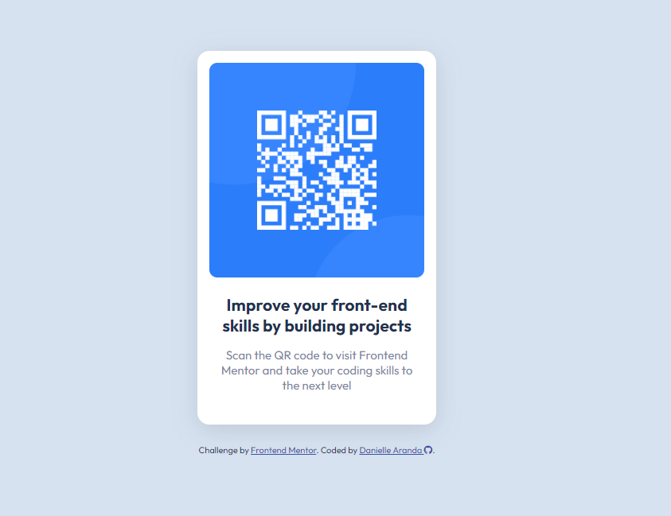

# Frontend Mentor - QR code component solution

This is a solution to the [QR code component challenge on Frontend Mentor](https://www.frontendmentor.io/challenges/qr-code-component-iux_sIO_H).

## Table of contents

- [Overview](#overview)
- [Built with](#built-with)
- [Lessons Learned](#lessons-learned)
- [Author](#author)

## Overview

Simple front end design for a QR Component.

[View my solution here](https://dlmedeiro.github.io/QR-Component/)

## Built with

- Semantic HTML5 markup
- CSS custom properties and CSS variables

## Lessons Learned
- My Semantic HTML needs some extra practice as I've picked up some bad habits.

## Author

- Website - [Danielle Aranda](https://dlmedeiro.github.io/)
- Frontend Mentor - [@DLMedeiro](https://www.frontendmentor.io/profile/DLMedeiro)

